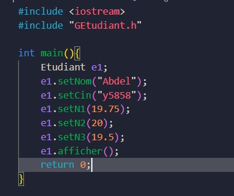
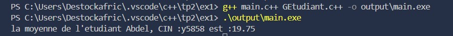
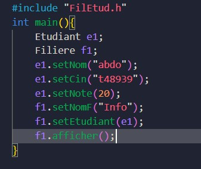
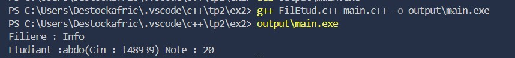

# TP C++ – Gestion d’Étudiants et de Filières

## Exercice 1 : Gestion d’un Étudiant

### Description
Ce projet simule la gestion d’un étudiant en C++.  
La classe `Etudiant` permet de stocker les informations d’un étudiant (nom, CIN et trois notes) et de calculer sa moyenne.

### Fonctionnalités

1. **Gestion de l’étudiant**
   - Définir le nom avec `setNom()`
   - Définir le CIN avec `setCin()`
   - Définir les notes avec `setNote1()`, `setNote2()`, `setNote3()`
   - Calculer la moyenne avec `calculMoyenne()`
   - Afficher les informations avec `afficher()`

### Capture du `main`

### Résultats du programme
Le programme affiche le nom, le CIN, les trois notes et la moyenne de l’étudiant.  

---

## Exercice 2 : Association Étudiant – Filière

### Description
Ce projet met en œuvre une association simple entre un étudiant et une filière.  
La classe `Filiere` contient un étudiant inscrit et permet d’afficher les informations de ce dernier avec le nom de la filière.

### Fonctionnalités

1. **Classe Étudiant**
   - Définir le nom, le CIN et la note avec les méthodes `setNom()`, `setCin()`, `setNote()`
   - Afficher les informations avec `afficher()`

2. **Classe Filiere**
   - Définir le nom de la filière avec `setNomFiliere()`
   - Affecter un étudiant avec `setEtudiant()`
   - Afficher le nom de la filière et les informations de l’étudiant avec `afficher()`

### Capture du `main`

### Résultats du programme
Le programme affiche le nom de la filière et les informations de l’étudiant inscrit.  

